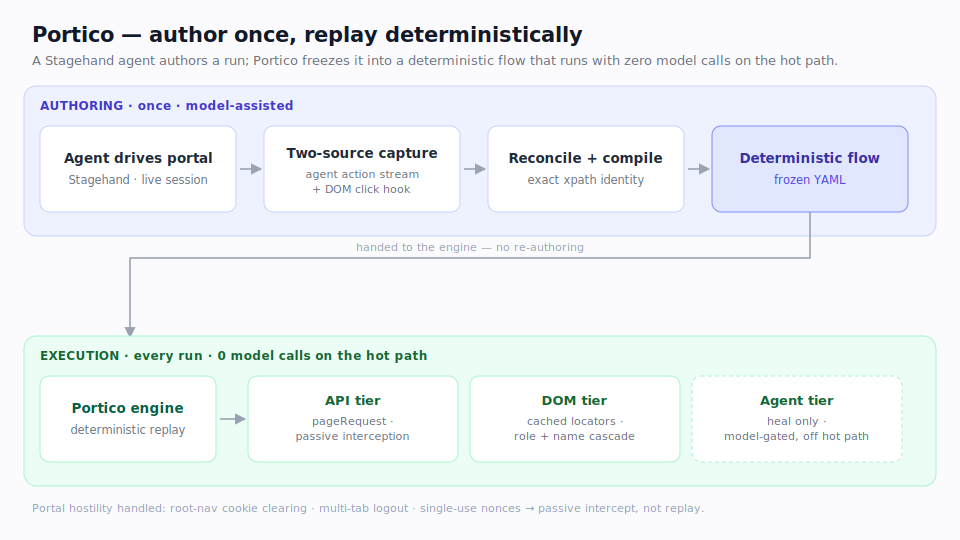

# Portico

**Open-source, self-hostable platform for reliable, deterministic browser
automation of authenticated portals** — built for regulated domains (healthcare
payer/EHR) where the automation must run in your own VPC and PHI never leaves.

> Deterministic-first, AI-assisted. The LLM authors and heals; it is **never on
> the hot path of a promoted flow**. A healthy run's latency is *browser speed*,
> not *model speed*. See [docs/ARCHITECTURE.md](docs/ARCHITECTURE.md).

<p align="center">
  
</p>

## Why

Browser-automation tools are typically a *library* or a *managed cloud*. The
production platform around them — control plane, secret vault, durable/resumable
runs, audit, replay, self-host — is left to each team to build. Portico is that
platform, and it **owns its deterministic execution engine**, built directly on
[Playwright](https://playwright.dev), behind the same swappable `EngineAdapter`
seam it always had ([ADR-0004](docs/decisions/0004-own-engine.md)).

## Repo layout

```
packages/
  flow-spec/   # declarative flow contract + compileRecording (types, pure)
  engine/      # EngineAdapter + PorticoAdapter (in-house, on Playwright), tiered runner, self-heal, deriveTier
  vault/       # secret resolution, redaction, TOTP
  store/       # SQLite store: runs · steps · sessions · flows · audit · author jobs
  author/      # agent authoring + two-source reconciliation (Stagehand)
apps/
  cli/         # `portico` runner: run · validate · confirm · sessions
  console/     # Next.js admin console (overview · runs · flows · sessions · connectors)
connectors/
  example-portal/  # template connector (discovery only, never commits)
docs/
  ARCHITECTURE.md · architecture.svg   # architecture + diagram
  decisions/0001-execution-engine.md   # engine adapter seam (superseded in part by 0004)
  decisions/0004-own-engine.md         # in-house engine, on Playwright
  decisions/0002-agent-authoring.md    # authoring + two-source reconciliation
  LIBRETTO-INTEGRATION-NOTES.md        # historical field notes (pre-ADR-0004)
```

## Status

Runs end-to-end. A live Epic/MyChart scheduling flow was **authored by
demonstration, validated, and replayed deterministically** against the live
portal — it reaches the appointment-selection screen and **stops before any
booking**.

| Piece | State |
|---|---|
| Flow spec + `compileRecording` (`@portico/flow-spec`) | ✅ |
| Engine (`PorticoAdapter` on Playwright, tiered runner, self-heal, `deriveTier`) | ✅ runs live |
| Vault (secret resolution, redaction, TOTP) | ✅ + tests |
| Store (SQLite: runs · steps · sessions · flows · audit · author jobs) | ✅ |
| Agent authoring + two-source reconciliation (`@portico/author`) | ✅ authored + validated live |
| Console (overview · runs · flows · sessions · connectors) | ✅ async authoring + live timelines |
| Scale path (control plane · Postgres/RLS · KMS · warm pool · fleet) | planned |

### Prove it live (no credentials needed)

```bash
pnpm install
npx playwright install chromium
node --import tsx apps/cli/src/index.ts run examples/smoke.flow.yaml \
  --base-url https://example.com --headless
# → COMPLETED, output: { "page_title": "Example Domain" }
```

## Dev

```bash
pnpm install
npx playwright install chromium   # one-time, for the engine
pnpm test          # package tests (e.g. vault)
pnpm typecheck
```

## Console

A Next.js admin console: overview, runs with step-level timelines (self-heal +
fail-safe), **flows** (author by demonstration → review → validate → confirm),
**sessions** (launch/attach a browser, scoped per connector), and connectors.

```bash
pnpm --filter @portico/console dev   # → http://localhost:4400
```

Authoring runs asynchronously with a live timeline; validated flows run the real
engine and the completed run appears live.

## Engine

`PorticoAdapter` runs **in-process** on Playwright behind the `EngineAdapter`
seam ([ADR-0004](docs/decisions/0004-own-engine.md)), telemetry off for
self-hosted PHI. Recovery from drift is **deterministic-first**: a scripted
overlay/popup-dismiss-and-retry step that only calls a model when one is
configured.

## License

Apache-2.0 (core). Commercial/cloud features (hosted control plane, SSO, managed
secrets, SLA) come later as an open-core layer.
